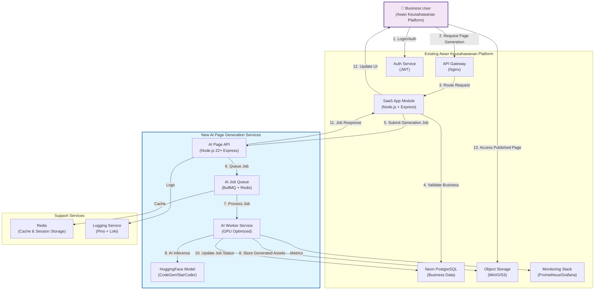
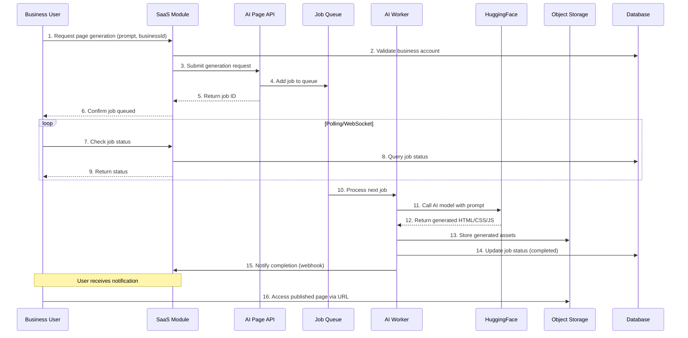
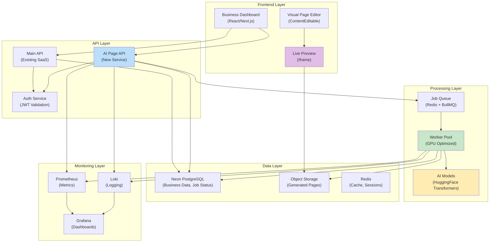
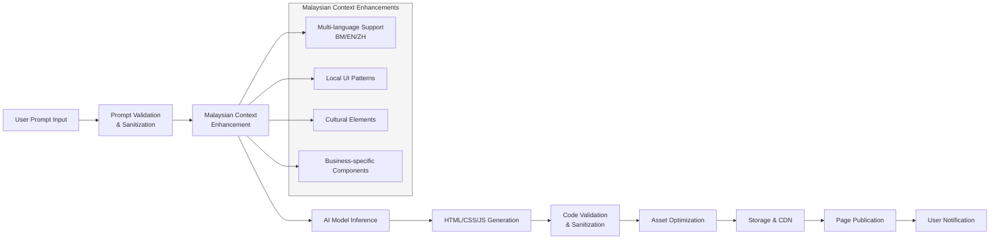

# Awan Keusahawanan - AI-Powered Website Generation Feature Enhancement

## Overview

This document details the integration of an AI-powered website generation feature into the Awan Keusahawanan platform, enabling Malaysian SME owners to instantly create professional landing pages using natural language prompts. This enhancement combines business management tools with AI-powered website creation in a single, integrated platform specifically designed for Malaysian businesses.

## Architecture Overview



## Feature Details

### 1. AI-Powered Page Generation

- Natural Language Processing: Users describe their desired website in natural language
- Multi-language Support: Understanding of Bahasa Malaysia, English, and Chinese prompts
- Context Awareness: Malaysian business context integration
- Template Variety: Professional, creative, and minimalist style options

### 2. Real-time Processing Pipeline



### 3. Malaysian Business Optimization

- Localized Templates: Pre-configured for common Malaysian business types
- Cultural Relevance: Malaysian design patterns and visual elements
- Multi-language Output: Support for BM, English, and Chinese content
- Local SEO: Optimization for Malaysian search engines

### 4. Integration with Existing Platform

- Unified Authentication: Single sign-on with existing Awan Keusahawanan accounts
- Billing Integration: Usage-based billing through existing Stripe integration
- Resource Management: GPU allocation through existing compute platform
- Storage Integration: Leverages existing MinIO/S3 object storage

## Component Relationship Diagram



## Data Flow Process



## Technical Implementation

### Backend Services Architecture

The AI-powered website generation feature extends the existing Awan Keusahawanan platform with several new services:

1. AI Page API Service (Node.js 22+):
   - Handles incoming generation requests
   - Validates user input and business permissions
   - Interfaces with the job queue system
   - Provides status updates on generation jobs
2. AI Worker Service (Python/Node.js):
   - GPU-optimized container for AI inference
   - Integrates with HuggingFace transformers
   - Implements prompt engineering for Malaysian context
   - Handles output validation and sanitization
3. Queue Management System (BullMQ + Redis):
   - Manages job prioritization and scheduling
   - Implements retry logic for failed jobs
   - Provides real-time job status updates
   - Ensures fair resource allocation

### Malaysian Context Integration

The system includes specialized processing for Malaysian business needs:

1. Multi-language Support:
   - Understanding of prompts in Bahasa Malaysia, English, and Chinese
   - Generation of content in appropriate languages
   - Language detection and automatic translation capabilities
2. Cultural Adaptation:
   - Malaysian design patterns and color schemes
   - Local business terminology and categorization
   - Region-specific layout preferences
3. Business-specific Optimization:
   - Templates tailored for common Malaysian business types
   - Integration with local payment and logistics providers
   - SEO optimization for Malaysian search engines

### Frontend Components

1. Prompt Interface
   - Natural language input with suggestions
   - Style and language selection
   - Preview of generated design
2. Page Editor
   - Basic content editing capabilities
   - Real-time preview
   - Mobile responsiveness testing
3. Publication Dashboard
   - Generation status monitoring
   - Published pages management
   - Analytics and performance tracking

## Setup and Deployment

### Prerequisites

- Node.js 22+
- Docker and Docker Compose
- Kubernetes cluster (for production)
- NVIDIA GPU-enabled nodes (for AI inference)
- Hugging Face API access

### Development Environment

1. Clone and setup the AI Page Generator service:

```bash
cd services/ai-page-generator
npm install
cp .env.example .env
# Configure environment variables
```

2. Start dependent services:

```bash
docker-compose -f docker-compose.dev.yml up -d
```

3. Run the service:

```bash
npm run dev
```

### Production Deployment

1. Build Docker image:

```bash
docker build -t your-registry/ai-page-generator:latest .
```

2. Deploy to Kubernetes:

```bash
kubectl apply -f k8s/ai-page-generator/
```

## Integration Points with Existing Platform

1. Authentication & Authorization:
   - Uses existing JWT-based authentication system
   - Respects workspace and user permissions
   - Integrates with existing role-based access control
2. Data Storage:
   - Job metadata stored in Neon PostgreSQL
   - Generated assets stored in MinIO/S3 object storage
   - Caching through Redis for improved performance
3. Monitoring & Logging:
   - Metrics exported to Prometheus
   - Logs aggregated through Loki
   - Dashboards in Grafana for operational visibility
4. Billing Integration:
   - Usage tracking through existing metering system
   - Integration with Stripe for payment processing
   - Resource-based billing (per generation or GPU-minute)

## Performance Considerations

1. GPU Resource Management:
   - Efficient model loading and inference optimization
   - Request batching for improved throughput
   - Automatic scaling based on queue length
2. Caching Strategy:
   - Prompt and result caching to avoid redundant processing
   - CDN integration for fast asset delivery
   - Session caching for improved user experience
3. Quality Assurance:
   - Automated testing of generated code validity
   - Performance benchmarking for page load times
   - Accessibility and SEO compliance checking

## Monitoring and Analytics

### Performance Metrics

- Generation Success Rate: Track successful page generations
- Processing Time: Monitor AI inference duration
- Resource Utilization: GPU and CPU usage metrics
- User Satisfaction: Page edit and publication rates

### Quality Metrics

- Code Validity: Validation of generated HTML/CSS/JS
- Accessibility Score: Compliance with accessibility standards
- Performance Score: Page load time and optimization
- SEO Readiness: Basic SEO best practices implementation

## Future Enhancements

### Short-term (Next 3 months)

- Advanced editing capabilities
- Template library for different industries
- Multi-page website generation
- E-commerce functionality integration

### Medium-term (3-6 months)

- AI-powered content suggestions
- Automated image generation
- A/B testing capabilities
- Integration with Malaysian business directories

### Long-term (6+ months)

- Voice-based interface
- Advanced personalization algorithms
- Predictive design trends
- Full website management suite

## Success Metrics

1. User Adoption
   - 30% of active users trying the feature within first month
   - 15% conversion to regular usage
2. Quality Standards
   - 95%+ valid HTML/CSS output
   - <5 second average generation time
   - <2% error rate in production
3. Business Impact
   - Reduced time-to-website for Malaysian SMEs
   - Increased platform engagement metrics
   - Positive feedback on local relevance

## Support and Maintenance

### Documentation

- API documentation for developers
- User guides in Bahasa Malaysia and English
- Troubleshooting common issues
- Best practices for optimal results

### Training Resources

- Video tutorials
- Live workshops for Malaysian businesses
- Template customization guides
- SEO optimization tips

This comprehensive architecture ensures that the AI-powered website generation feature seamlessly integrates with the existing Awan Keusahawanan platform while providing a robust, scalable solution tailored to the needs of Malaysian SMEs.
